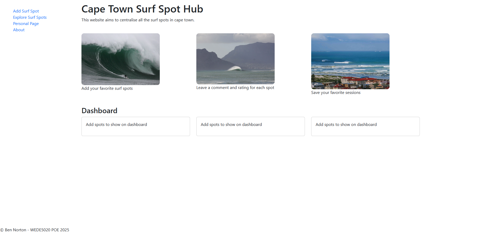
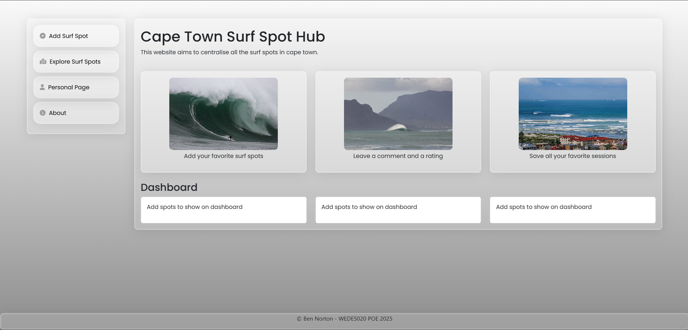
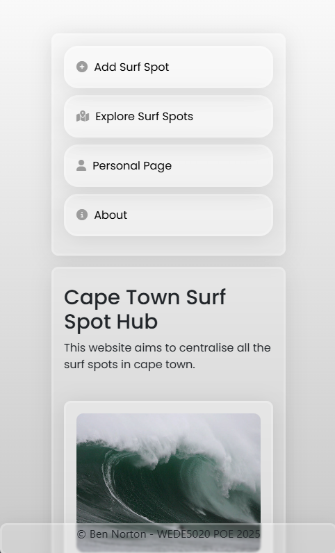
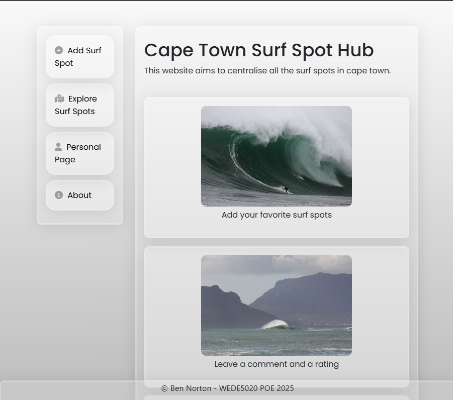

# WEDE5020POE
please view this ReadMe on my GitHub repository over at: https://github.com/ben11norton/WEDE5020POE/tree/master

## POE Parts:
### Part 1
### Part 2
### Part 3

## POE_Part1:

## POE_Part2
### Video Demonstration
[Click here to watch my Part 2 demo video](images/POE_Part2_Demo.mp4)

### Home Page After Styling

### Home Page Responsiveness: Medium Screen Size

### Home Page Responsiveness: Small Screen Size

## Design Features: Styling set up in my style.css
- the main theme for this project was is to have a sleek user friendly interface
- for this I chose a glassmorphism theme which gives a modern look to the website without distracting the user from the main functionality
- I employed this theme using my css classes named glassmorphismCard and glassmorphismSideBarCard
- alongside the glassmorphismSideBarCard class for my side bar I used css psudo elements such as :hover and ::before to allow me to add some basic styling animations in order to capture more attention from the user towards the side bar
- alongside the glassmorphism style I then used a liner gradient grey background to finsish off the modern look and feel of the website

## Choices for screen resposiveness:
- In order to cater for different screen sizes I used bootstrap.css
- This css/js bundle package allows me to leverage the grid system using rows and columns
- For example, if I want to have a card block that fills the whole width of the screen then I would place col-12 inside of a row 
- If I wanted 2 card blocks side by side then I can use two col-6 classes inside a row
- The number of columns per row just needs to add up to 12 in total to span the whole width of the screen and you can then organise html in this grid format
- This is especically useful once the screen size starts changing as if I have 3 cards side by side on a large screen with col-4 each 
- I can then access different screen size class by using col-<screen-size>-<col-size>. For example, if I want my 3 large screen column 4 cards to span the whole width of the screen then I use col-lg-4 for each of the 3 cards. Then when the screen reduces in size I only want 2 to show side by side I can then use col-md-6 which will make the first 2 cards fill up half the screen width on medium size screens and then third card shown below. 
- If the screen then shrinks further to a small size phone, then I can access col-12 the default column, which will then stack each card on top of each other within that row as shown in Figure * Home Page resposiveness: small screen size

## Other styling decisions:
- In addition to my main css styling and boostrap resposiveness I added fontawesome icons to make the sidebar pop more
- Alongside this, I also emplyed Googl Fonts font family Popoins to make the overall look and feel of the website more polished

## Changelog for Part 2:
67a3f63 added demo video showcasing screen resposiveness and styling of pages to be viewed on git hub
355d318 finalising set up for different screens
bcc7873 update readme for font awesome icons and google fonts + demo video link
f402887 readme headings
3eea256 update readme to explain use of boostrap.css
4251fc9 update readme for poe part 2 styling and screen resposiveness
8e84724 new styled sidebar navigation and transferring other page styling across
54c1627 styling sidebar and adding in font awesome for side bar
c7aeb70 add styling and bottom footer class for footer
11300f8 add font family Poppins to our dashboard
be31646 adding Poppins google font and applying it to our side bar text content class
e9207f1 adding color theme to dashboard
1353f46 adding dashboard styling using boostrap columns for different screen resposiveness
0a97ae8 setting up styling using inline for dashboard
1f22664 adding glassmorphism styling for our cards to put on our dashboard
8663f95 Create README.md
b404ef8 Added progress screen shot of home page
785dc94 Added navigation to all my different pages through the sidebar
25b8a1b Added surf photos to home page
b5bf96a Added our other html pages that are linked up for our sidebar to now work
9c5ffd1 added my sidebar so we can now get ready to move to our other pages
545171c setting up home screen structure
2e35726 setting up base html boilter plate for main html page
a24c4ca Initial commit

## POE_Part3 - JavaScript Functionality:

### Create - Edit - Delete functionality 

#b405bd8 finalising CRUD functionality and adding demo vidoes for part 3
6afef21 update for surf spot details carrying across to dashboard
defbbaf delete functionality upate
83156f7 added remove all surf spots feature to clear all the surf spot details
5b383a1 setting up add surf spot prepopulating modal for edit
f2375d3 add edit and delete icons for add surf spots
504a15f storing surf spot details with id so we can access them for editing and deleting
59b8510 displaying added surf spot on dashboard
0c3d1f5 added page tag div to let us keep track of which active page we are on when navigating to a new page in our js script
c854633 storing new surf spots objects in a global array that we can then cache in local storage to display on the dashboard
032260d set up for adding new surf spots on our addSurfSpot.html# Changelog for Part 3:
