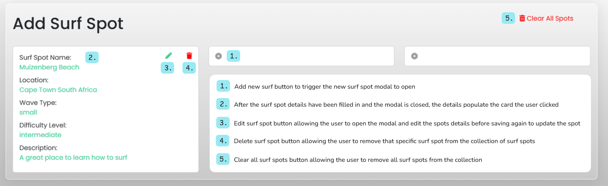
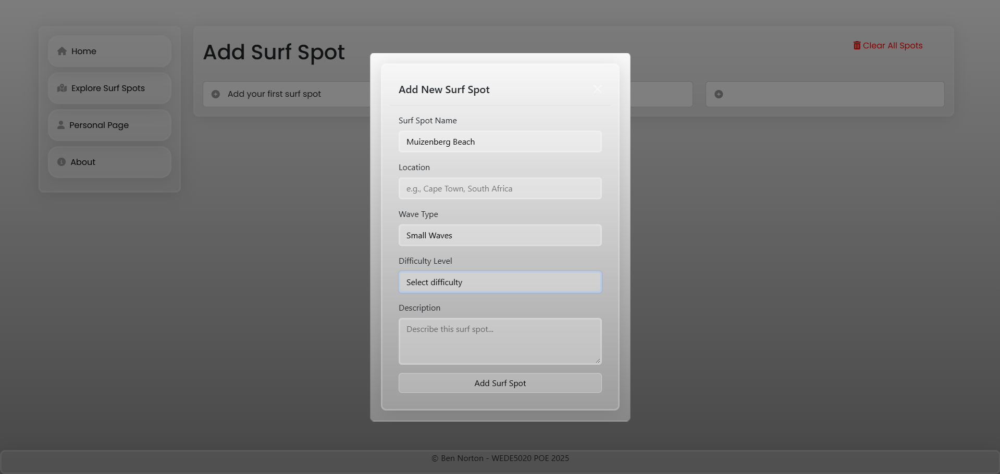

# WEDE5020POE
please view this ReadMe on my GitHub repository over at: https://github.com/ben11norton/WEDE5020POE/tree/master

## POE Parts:
### Part 1
### Part 2
### Part 3

## POE_Part1:

## POE_Part2
### Video Demonstration
[Click here to watch my Part 2 demo video](images/POE_Part2_Demo.mp4)

### Home Page After Styling

### Home Page Responsiveness: Medium Screen Size

### Home Page Responsiveness: Small Screen Size

## Design Features: Styling set up in my style.css
- the main theme for this project was is to have a sleek user friendly interface
- for this I chose a glassmorphism theme which gives a modern look to the website without distracting the user from the main functionality
- I employed this theme using my css classes named glassmorphismCard and glassmorphismSideBarCard
- alongside the glassmorphismSideBarCard class for my side bar I used css psudo elements such as :hover and ::before to allow me to add some basic styling animations in order to capture more attention from the user towards the side bar
- alongside the glassmorphism style I then used a liner gradient grey background to finsish off the modern look and feel of the website

## Choices for screen resposiveness:
- In order to cater for different screen sizes I used bootstrap.css
- This css/js bundle package allows me to leverage the grid system using rows and columns
- For example, if I want to have a card block that fills the whole width of the screen then I would place col-12 inside of a row 
- If I wanted 2 card blocks side by side then I can use two col-6 classes inside a row
- The number of columns per row just needs to add up to 12 in total to span the whole width of the screen and you can then organise html in this grid format
- This is especically useful once the screen size starts changing as if I have 3 cards side by side on a large screen with col-4 each 
- I can then access different screen size class by using col-<screen-size>-<col-size>. For example, if I want my 3 large screen column 4 cards to span the whole width of the screen then I use col-lg-4 for each of the 3 cards. Then when the screen reduces in size I only want 2 to show side by side I can then use col-md-6 which will make the first 2 cards fill up half the screen width on medium size screens and then third card shown below. 
- If the screen then shrinks further to a small size phone, then I can access col-12 the default column, which will then stack each card on top of each other within that row as shown in Figure * Home Page resposiveness: small screen size

## Other styling decisions:
- In addition to my main css styling and boostrap resposiveness I added fontawesome icons to make the sidebar pop more
- Alongside this, I also emplyed Googl Fonts font family Popoins to make the overall look and feel of the website more polished

## Changelog for Part 2:
- 67a3f63 added demo video showcasing screen resposiveness and styling of pages to be viewed on git hub
- 355d318 finalising set up for different screens
- bcc7873 update readme for font awesome icons and google fonts + demo video link
- f402887 readme headings
- 3eea256 update readme to explain use of boostrap.css
- 4251fc9 update readme for poe part 2 styling and screen resposiveness
- 8e84724 new styled sidebar navigation and transferring other page styling across
- 54c1627 styling sidebar and adding in font awesome for side bar
- c7aeb70 add styling and bottom footer class for footer
- 11300f8 add font family Poppins to our dashboard
- be31646 adding Poppins google font and applying it to our side bar text content class
- e9207f1 adding color theme to dashboard
- 1353f46 adding dashboard styling using boostrap columns for different screen resposiveness
- 0a97ae8 setting up styling using inline for dashboard
- 1f22664 adding glassmorphism styling for our cards to put on our dashboard
- 8663f95 Create README.md
- b404ef8 Added progress screen shot of home page
- 785dc94 Added navigation to all my different pages through the sidebar
- 25b8a1b Added surf photos to home page
- b5bf96a Added our other html pages that are linked up for our sidebar to now work
- 9c5ffd1 added my sidebar so we can now get ready to move to our other pages
- 545171c setting up home screen structure
- 2e35726 setting up base html boilter plate for main html page
- a24c4ca Initial commit

## POE_Part3 - JavaScript Functionality:

### Create - Edit - Delete (CRUD) functionality:

### Interactive Features:
- Modal 
- CRUD functionality and updating dashboard

### Modal: Adding a new surf spot (addSurfSpot.html)
- This modal allows users to add a new surf spot easily without having to leave the addSurfSpot.html page.
- This increases ease of use for the user allowing seamless intractivity with the web page.
#### Implementation of modal:
- I used the boostrap.css library built in modal for the showing and hiding of the modal paried up with vanilla javascript by employing the use of document.querySelector() method and the .show() and .hide() methods to toggle the visibility of the modal

#### Add Surf Spot Page Functionality Description

#### Add Surf Spot modal

### CRUD Demo Video:
[Adding Surf Spots to Dashboard POE_Part3](images/POE_Part3_Functionality/AddSurfSpotsToDashboard.mp4)

[Editing Surf Spots Functionality POE_Part3](images/POE_Part3_Functionality/editSurfSpotFunctionality.mp4)

[Clearing and deleting Surf Spots Functionality POE_Part3](images/POE_Part3_Functionality/clearSurfSpotsFunctionality.mp4)

### My Functionality Logic Overview (`script.js`)

The script.js I wrote handles all of the dynamic behavior for all the website pages, allowing for surf spot CRUD functionality alongside the use of local storage caching across the website.

Detaied descriptions of the code can be found in the comments of this file.

---

### **Page Initialization**
- Firstly I define my **global variables** for the surf spot cards as well as for my local storage cached details.
- I then gave all of my html pages a div with a class of `.activePageTag` element which allowed me to **detect the current page** (`dashboardPage`, `addSurfSpotPage`, etc.).
- Because I could then know which page I would be on I would call `triggerActivePageFunctions()` switch statment to run specific functions depending on the active page.
- For example, on my dashboard and add surf spot pages, I then call `checkAndDisplaySurfSpots()` to render the stored surf spots information.

---

### **Local Storage Handling**
- In terms of dispalying stored information, my `checkAndDisplaySurfSpots()` gets the locallyt  cached surf spot data (`surfSpotDetailsLocalStorageArray`) from `localStorage`.
- I then parse this stored data in my local storage array and loop through the array to grab each surf spot so I can populate dashboard cards dynamically.  
- The `showNewSurfSpotInfo()` function is also called for each stored surf spot object. This allows me to fill the corresponding card with the correct data.

---

### **Add Surf Spot Modal**
- My `showAddSurfSpotModal()` function is used to display the Bootstrap modal when a surf spot card is clicked.  
- Then when the details in the modal form are filled in, I call `addNewSurfSpot()` as an onclick function:
  - all form data (inputs, selects, textareas) are then stored as key-value pairs.  
  - this new surf spot data is then added to my global array allowing me to then add it to the ** `localStorage cache`**.
  - once the details are saved in the cached I then call `showNewSurfSpotInfo()` to hide the modal and show the saved details.  

---

### **Populating Surf Spot Cards**
- My `showNewSurfSpotInfo()` function:
  - I use a hidden surf spot card template to then clone (`
` and `<meta description>` tags to increase and search visibility.
- `<meta name="robots" content="index, follow">` were then included in my html page to allow search engines to index the page.
- Alongside this, all of the images in the dashboard include accessible `alt` text for improved accessibility, coupled with the navigation icons being labeled for extra clarity.
- Heading hierarchy was then added using the following HTML elements for order: `<h1>` followed by `<h2>`, etc.
- Employing boostrap.css allowed for the website to be fully responsive for different screen sizes.

#### Functional Enhancements
- Using icons from fontawesome I enhanced sidebar navigation with clear icons and matching/corresponding text for better user experience.
- Across all the html pages I standardized the use of google fonts, Bootstrap, and Font awesome to make the website more consistent visually.
- Within my HTML pages and throughout my script.js I included comments, alongside structure improvements, to increase clarity and maintainability of my code.

---

### Add Surf Spot Page (`addSurfSpot.html`)

#### SEO Improvements
- I included descriptive `<title>` and `<meta description>` tags to better display my Add Surf Spot HTML page.
- Alongside the title and meta description, I included `<meta name="robots" content="index, follow">`, which futher increase search engine based indexing for the website.
- In terms of navigation and internal links, these were optimzed for better SEO flow.
- I also applied semantic HTML structuring coupled with accessible form labels for screen readers.
- Lastly, I ensured the page layout was also fully responsive to different screen sizes.

## Email Form Functionality (about.html):
[Demo showing contact email form functionality POE_Part3](images/POE_Part3_Functionality/emailContactForm.mp4)

###  Contact Form Web3Forms Integration
- Here I used web3Forms for a lightweight contact form for my website (https://web3forms.com/);
- This form allows users to send messages straight to my email without having to do any from of backend configuration.

#### **Implementation Overview**
- I implemented a html form with an endpoint url which employs the Web3Forms API at `https://api.web3forms.com/submit`.
- The form also uses HTML email and text area validation to make sure all of the required fields are completed by the user before they submit the form.
- In terms of styling, I employed bootstrap.css rows and cols techique and my custom `glassmorphismCard` class for styling consistency.

## Changelog for Part 3:
- b877e70 Added description explaining the use of web3Forms for the contact form and submission validation
- caed1bc Added email contact form functionality video demo to README
- 56186c5 added contact email form
- bd66e78 added SEO and SEO improvements description to README
- cb9576b Added SEO features to dashboard and add surf spot pages
- 49e392e Add CRUD demo vidoe and header
- 09a422d added POE part 3 demo screen shot and video headers to readme
- db2f9b1 update addSurfSpot modal screenshot header
- 9c5d903 added addSurfSpotPage screenshot descriptions to readme
- 391e92e update readme formatting for demo videos
- be7360e update functionality demo recording file path for readme
- 840b8f7 update read me to format git logs
- 6bd90d3 add git log for part 3
- b405bd8 finalising CRUD functionality and adding demo vidoes for part 3
- 6afef21 update for surf spot details carrying across to dashboard
- defbbaf delete functionality upate
- 83156f7 added remove all surf spots feature to clear all the surf spot details
- 5b383a1 setting up add surf spot prepopulating modal for edit
- f2375d3 add edit and delete icons for add surf spots
- 504a15f storing surf spot details with id so we can access them for editing and deleting
- 59b8510 displaying added surf spot on dashboard
- 0c3d1f5 added page tag div to let us keep track of which active page we are on when navigating to a new page in our js script
- c854633 storing new surf spots objects in a global array that we can then cache in local storage to display on the dashboard
- 032260d set up for adding new surf spots on our addSurfSpot.html# Changelog for Part 3:
